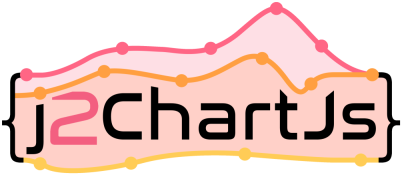

**j2ChartJs**
allows generating configuration objects for the fantastic **[Chart.js](http://www.chartjs.org/)** JavaScript
library from your Java code.

- **[Project Documentation](md/doc.md)**
- **[More examples](md/example.md)**

## Maven Central

```xml
<dependency>
  <groupId>de.yanwittmann</groupId>
  <artifactId>j2chartjs</artifactId>
  <version>1.1</version>
</dependency>
```

## Sample usage
**Java**:
Build any of the available chart types and export to json.
```Java
BarChartDataset dataset = new BarChartDataset()
    .addData(12, 32, 8, 45, 27, 23)
    .setLabel("Sample Dataset")
    .setBackgroundColor(ChartColors.BACKGROUNDS)
    .setBorderColor(ChartColors.BORDERS)
    .addBorderWidth(1);

BarChartData data = new BarChartData()
    .addDataset(dataset)
    .addLabels("Entry 1", "Entry 2", "Entry 3", "Entry 4", "Entry 5", "Entry 6");

ChartOptions options = new ChartOptions()
    .setTitle(new TitleOption().setText("Sample Chart").setDisplay(true));

BarChart chart = new BarChart()
    .setChartOptions(options)
    .setChartData(data);

JSONObject jsonChartConfiguration = chart.build();
```

**HTML**:
Link to a ChartJs script with version >= 3.0 and define a canvas.
```html
<script src="https://cdn.jsdelivr.net/npm/chart.js@3.5.1/dist/chart.min.js"></script>
<canvas id="canvasId" style="border: gray 2px solid;">
```

**JavaScript**:
Load the exported JSON configuration together with the canvas element into a chart object.
```JavaScript
var ctx = document.getElementById('canvasId');
new Chart(ctx, jsonChartConfiguration);
```

### Quick Charts
Quick charts take away a lot of the configuration overhead and let you focus on your data.  
**Java**:
Also export to JSON when the chart is ready.
```Java
new QuickBarChart()
    .addDataset("Data 1", 10, 20, 30)
    .addDataset("Data 2", 34, 22, 14)
    .addLabels("Point 1", "Point 2", "Point 3")
    .setTitle("Quick chart")
    .setGridLinesVisible(false)
    .setBeginAtZero(true)
    .build();
```

## Compatibility

Supports only ChartJs `3.x`.  
Might work for older versions but not all features will be supported there.

## JavaDoc
Find the JavaDoc on **[javadoc.io](https://javadoc.io/doc/de.yanwittmann/j2chartjs)**.

## License

**j2ChartJs** is licensed under the **[Apache 2.0 license](https://www.apache.org/licenses/LICENSE-2.0.txt)**
